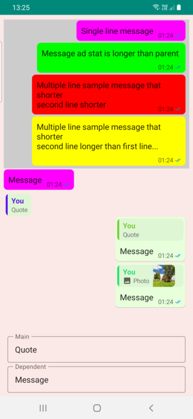
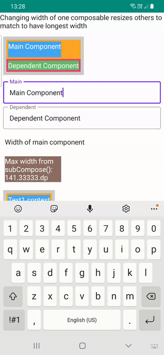

## Flexible Chat Row and Resizable SubcomposeLayout


Flexible chat row,  `ChatFlexBoxLayout`, that positions its elements based on number of lines message text has,
parent width, message and message status width.
And `SubcomposeColumn` created using **SubComposeLayout** which remeasures its children based on
longest children. This is useful for matching quote message and message length after position
calculation. These two composables are useful for creating dynamic message rows that positions children and positions message, message date and message status.

There are 3 implementation files to try `ChatFlexBoxLayout`, and `SubcomposeColumn` which are
`DemoFullChat.kt`, `DemoChatAndWidth.kt`, and `DemoResizableColumn.kt`

| Full Chat      | Chat Width   | Resizable|
| ----------|-----------| -----------|
|  |  |  |


### ChatFlexBoxLayout
This is a layout that measures and positions message and another container that uses message
date or message date and message received status like messaging apps does.

There are 4 possible conditions to position message and stats

* Single line message text and status is shorter than parent width(Magenta in sample)
* Single line message text and status is longer than parent width(Green in sample)
* Multiple line message with last line width and message status is shorter message text length + right padding(Red in sample)
* Multiple line message with last line width and message status is longer message text length + right padding(Yellow in sample)

#### Usage

```kotlin
ChatFlexBoxLayout(
    modifier: Modifier = Modifier,
    text: String,
    color: Color = Color.Unspecified,
    fontSize: TextUnit = 16.sp,
    fontStyle: FontStyle? = null,
    fontWeight: FontWeight? = null,
    fontFamily: FontFamily? = null,
    letterSpacing: TextUnit = TextUnit.Unspecified,
    textDecoration: TextDecoration? = null,
    textAlign: TextAlign? = null,
    lineHeight: TextUnit = TextUnit.Unspecified,
    overflow: TextOverflow = TextOverflow.Clip,
    softWrap: Boolean = true,
    maxLines: Int = Int.MAX_VALUE,
    messageStat: @Composable () -> Unit,
    onMeasure: ((ChatRowData) -> Unit)? = null
)
```
Since `TextLayout` is required to get text length, last line width and other properties it's internal to this composable but properties of `Text`composable can be set with same as it's done using `Text`.

`onMeasure` returns internal layout data of this row, that's how i set colors differently in **chat width sample**.
`messageStat` is composable that contains message text or status if you need to.

```kotlin
    ChatFlexBoxLayout(
        modifier = Modifier
            .background(color, shape = RoundedCornerShape(8.dp))
            .padding(start = 2.dp, top = 2.dp, end = 4.dp, bottom = 2.dp),
        text = text,
        messageStat = {
            MessageTimeText(
                modifier = Modifier.wrapContentSize(),
                messageTime = messageTime,
                messageStatus = messageStatus
            )
        },
        onMeasure = { chatRowData ->
            color = when (chatRowData.measuredType) {
                0 -> Color.Yellow
                1 -> Color.Red
                2 -> Color.Green
                else -> Color.Magenta
            }
        }
    )
```

Another overload of `ChatFlexBoxLayout` takes two Composables as arguments which 
custom **message** Composable can be used instead of String or AnnotatedString.
```kotlin
@Composable
fun ChatFlexBoxLayout(
    modifier: Modifier,
    message: @Composable () -> Unit,
    messageStat: @Composable () -> Unit = {},
    chatRowData: ChatRowData,
    onMeasure: ((ChatRowData) -> Unit)? = null
) {
  //...
}
```

Use with `remember { ChatRowData() }` to provide stats and invoke `measureText(chatRowData, it)`
to set text properties to this data
```kotlin
            val chatRowData = remember { ChatRowData() }

            ChatFlexBoxLayout(
                modifier = Modifier.padding(
                    start = 2.dp,
                    top = 2.dp,
                    end = 8.dp,
                    bottom = 2.dp
                ),
                message = {
                    Text(
                        modifier = Modifier.padding(horizontal = 6.dp, vertical = 4.dp),
                        text = text,
                        fontSize = 16.sp,
                        onTextLayout = {
                            // ⚠️ THIS IS REQUIRED TO MEASURE Text size and get line count
                            measureText(chatRowData, it)
                        }
                    )
                },
                messageStat = {
                    MessageTimeText(
                        modifier = Modifier.wrapContentSize(),
                        messageTime = messageTime,
                        messageStatus = messageStatus
                    )
                },
                chatRowData = chatRowData
            )
        }
```

## SubcomposeColumn

This is a layout that uses SubcomposeLayout to find longest child and then remeasure again
and set every child to this max width. There are 2 overloads of this Composable if
you only need to use direct 2 children you can use which returns size of main component
as `IntSize`

```kotlin
fun SubcomposeColumn(
    modifier: Modifier = Modifier,
    mainContent: @Composable () -> Unit = {},
    dependentContent: @Composable (IntSize) -> Unit
) {
...
}
```

This overloaded function is suitable for layout with any number of children

```kotlin
@Composable
fun SubcomposeColumn(
    modifier: Modifier = Modifier,
    content: @Composable () -> Unit = {},
) {

    SubcomposeLayout(modifier = modifier) { constraints ->

        var recompositionIndex = 0

        var placeables: List<Placeable> = subcompose(recompositionIndex++, content).map {
            it.measure(constraints)
        }

        val maxSize =
            placeables.fold(IntSize.Zero) { currentMax: IntSize, placeable: Placeable ->
                IntSize(
                    width = maxOf(currentMax.width, placeable.width),
                    height = currentMax.height + placeable.height
                )
            }

        // Remeasure every element using width of longest item as minWidth of Constraint
        if (!placeables.isNullOrEmpty() && placeables.size > 1) {
            placeables = subcompose(recompositionIndex, content).map { measurable: Measurable ->
                measurable.measure(Constraints(maxSize.width, constraints.maxWidth))
            }
        }

        layout(maxSize.width, maxSize.height) {
            var yPos = 0
            placeables.forEach { placeable: Placeable ->
                placeable.placeRelative(0, yPos)
                yPos += placeable.height
            }

        }
    }
}
```
